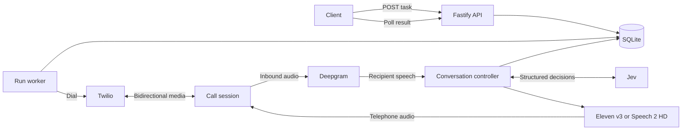

# Architecture and conversation policy

Yapper is one long-running Node.js process. Fastify serves the API and Twilio integrations. SQLite stores requests, run state, transcript entries, idempotency records, and results on persistent disk. A worker limits concurrent calls and advances queued runs independently of the original HTTP request.

## Separate conversation policy from speech

The request selects a speech provider. It does not change the payment-collection policy or grant the recipient authority to change the task. Jev interprets the recipient's answers into structured decisions; application code controls allowed state transitions, response selection, stop conditions, and reminder limits. This keeps the task narrow and makes both providers comparable using the same workflow.

The collection state stores identity confirmation, payment status, promised date, evidence, reminder count, turn count, and completion status. The workflow asks for identity first, then payment status, then a payment date when necessary. The submitted organization's name, amount, reference, and deadline are the task's source of truth. Recipient requests to change instructions do not redefine them.

The deadline is a date in the task's timezone. A late promised date prompts a request to pay today. The reminder counter caps repetition; failure to obtain an acceptable resolution produces a human-follow-up outcome. This is intentionally bounded: the agent does not repeatedly call, negotiate new terms, collect card or bank details, or keep pressuring a recipient indefinitely.

An opt-out, wrong recipient, or dispute ends the collection conversation. Opted-out numbers are persisted in a suppression list to prevent subsequent calls. Twilio answering-machine detection must identify a human before the service opens a conversation; other outcomes end for human review without leaving a payment message. Conversational confirmation alone is not suitable for disclosing highly sensitive account information.

## Interruption handling

The live stream delivers inbound telephone audio to Deepgram. Speech-start events interrupt the current response immediately. The session aborts outstanding synthesis and sends Twilio a `clear` message to discard queued outbound audio. Subsequent final transcripts advance the controller. Generation counters discard stale audio and decisions. Recipient segments received since the last committed decision are combined for the next judgment so interrupting a slow decision does not lose previously spoken facts. An opt-out or other mandatory stop remains in effect if the goodbye is interrupted.

Telephone media is mono, 8 kHz μ-law. Both providers are requested in this compatible format before being streamed to Twilio. This transport limits fidelity regardless of the selected TTS model. Network latency, transcription endpointing, and provider time to first audio all affect the perceived conversation delay.

The transcript captures generated agent responses and recognized recipient speech. An interrupted agent entry is marked when applicable; generated text is not proof that all of it reached the recipient.

## Asynchronous lifecycle and durability

Accepted tasks are persisted before the API acknowledges them. Idempotency prevents a client retry from creating a second run. The worker moves runs from `queued` through `dialing` and `in_progress` into a terminal status. Terminal runs are not automatically restarted or redialed.

SQLite makes this a **single-instance service**. Run one application process against one local persistent database. Do not horizontally scale replicas against the same file or place the database on a network filesystem. Back up the database using a SQLite-aware mechanism.

An in-flight telephone conversation cannot be reconstructed safely after process loss. Recovery must preserve what is known and surface interrupted work for human review rather than automatically redialing a recipient. See [operations](operations.md) for restart handling and reconciliation.

## Boundaries

- Yapper records statements; it has no bank, invoice, or ledger access.
- The workflow is specialized for payment collection. A new task type needs its own schema, policy, result contract, and tests.
- There is no arbitrary callback URL or outbound result webhook. Clients poll the API.
- Raw call audio is not the result contract. Configure provider-side recording and retention separately if your use case requires them.
- A live deployment sends recipient data to the configured telephone, transcription, decision, and speech providers. Protect the SQLite volume and limit access to the API.
